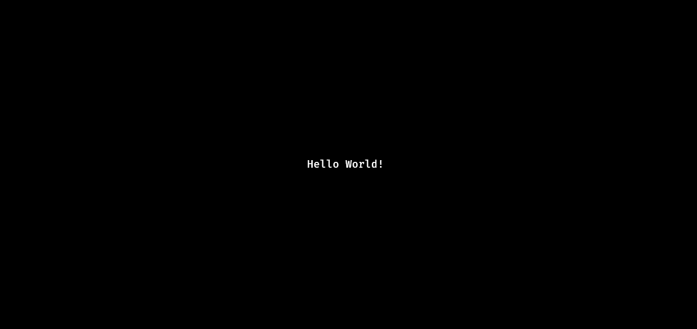

# **GGUI** - A Lightweight Terminal User Interface

### Hello World example
```C++
#include "ggui.h"

using namespace GGUI;

int main() 
{
    GGUI::GGUI(
        title("Welcome to GGUI!") | 
        node(new textField( 
            position(STYLES::center) | 
            text("Hello World!")
        ))
    );

    while (true) {
        // ... 
    }
}
```



### For more examples see [examples/README.md](./examples/README.md) folder. 

# Features
 - ### Cross platform (Windows, Linux, *"Android"*)
 - ### **Dynamic containers** with **horizontal** and **vertical** lists
 - ### **Text fields**, with left, center and right alignments
 - ### **Canvas** with builtin **sprite animation** handling
 - ### Fully customizable **progress bars** with even **multi line** support!
 - ### Customizable borders for all drawn elements
 - ### **Mouse support** with hover and focus effects
 - ### **Buttons** and **switches**
 - ### **Transparency** control
 - ### Custom **event handling** with ease of use.
 - ### *Should* contain everything you need to **interact with a terminal**
 - ### **Simple integration** to your projects with single `.h` and `.lib` file
    ```
    g++ GGUI.lib ...
    ```
 - ### **Optimized** for **Blazing fast** runtime with c++17 constexpr!

--- 

# Contributing to development of **GGUI**
- ### Initialize project locally with the `init.*` script.
- ### Exporting this project as library is documented in [bin/export/README.md](./bin/export/README.md).


## Release Validation
### Run these following commands to check if the current changes meet the stability requirements.
```bash
./bin/analytics/leaks.sh -F         # Full memory analysis
./bin/analytics/benchmark.sh -F     # Full CPU profiling
./bin/analytics/benchmark2.sh -a    # Multi-event perf analysis
./bin/analytics/time.sh 15 120      # Extended growth analysis
```
### More about scripts at [bin/analytics/README.md](./bin/analytics/README.md)

