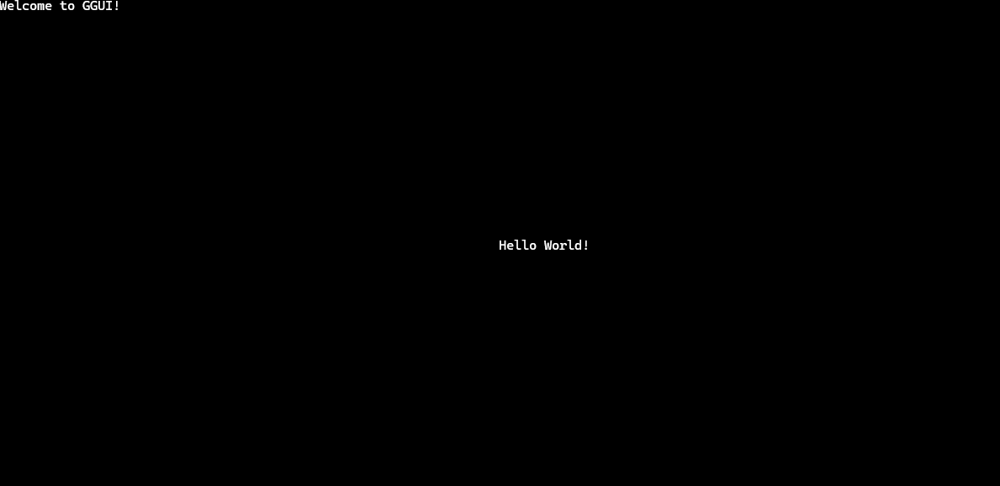

# **GGUI** - A Lightweight Terminal User Interface

### Full documentation [Here](https://gabidal.github.io/GGUI-Document/)

### Hello World example
```C++
#include <ggui.h>

using namespace GGUI;

int main() 
{
    GGUI::GGUI( // Initialize GGUI
        title("Welcome to GGUI!") | 
        node(new textField( 
            position(STYLES::center) | 
            text("Hello World!")
        ))
    );

    GGUI::waitForTermination(); // Wait until user gives signal to close (ctrl+c)
}
```



### For more examples see [examples/README.md](./examples/README.md) folder. 

# Features
 - ### Cross platform (Windows, Linux, *"Android"*)
 - ### **Dynamic containers** with **horizontal** and **vertical** lists
 - ### **Text fields**, with left, center and right alignments
 - ### **Canvas** with builtin **sprite animation** handling
 - ### Fully customizable **progress bars** with even **multi line** support!
 - ### Customizable borders for all drawn elements
 - ### **Mouse support** with hover and focus effects
 - ### **Buttons** and **switches**
 - ### **Transparency** control
 - ### Custom **event handling** with ease of use.
 - ### *Should* contain everything you need to **interact with a terminal**
 - ### **Simple integration** to your projects with single `.h` and `.lib` file
    ```
    c++ -I./ggui.h -L./ggui.lib ...
    ```
 - ### **Optimized** for **Blazing fast** runtime with c++17 constexpr!
 - ### **Graceful exit** be it ctrl+c or normal exit, GGUI cleans up after itself 
--- 

# Manual Building
### ./bin/init.sh triggers meson to build the core library.
### Manual build you could do something like this:
```Bash
c++ -std=c++17 -O3 -I./src ./src/**/*.cpp -o ggui     # This will yank main.cpp into it as well, you can remove it if CLI is not needed.
```
### Manual library build
```Bash
c++ -std=c++17 -O3 -I./src -c ./src/**/*.cpp -o ggui.lib   # This will compile all source files into a single library file.
```
### Then for the header export:
```Bash
c++ -std=c++17 -O3 -I./bin/export ./bin/export/buildGGUILib.cpp -o headerGenerator   # This will build the automated builder.
./headerGenerator --headers-only --source-root ./           # This will generate automatically ggui.h, you can also add '--include-internal' for building ggui_dev.h 
```

# Automatic Building
- ### Initialize project locally with the `init.sh` script.
  - Will also remove any existing build directory
  - only builds ggui_core 
- ### Build specific targets with: `build.sh` script.
  - uses positional arguments!
  - give the build type first and then the target(s)
    ```bash
    ./bin/build.sh profile ggui     # Links ggui_core with main.cpp
    ./bin/build.sh release build_native_archive # builds a usable archive and auto generates headers under ./bin/export/
    ```
- ### Cross-platform export static libraries and headers with: `export.sh` script.
  - Basically a helper script for `./bin/build.sh release build_native_archive` and the cross-platform configuration
  - Cross-platform configs are located in `./bin/export/`, you can add your own platforms if needed (needs some hassling)
  - Old system without meson:
    ```bash
    c++ buildGGUILib.cpp && ./a.exe
    ```
- ### Run test suite with: `test.sh` script.
  - Takes build type as args
  - Cannot recognize faulty rendering `:(`

## How i measure performance?
```bash
# Build types are: release, debug, profile
./bin/analytics/benchmark.sh -Full release      # Full CPU profiling
./bin/analytics/time.sh 5 120 release           # short duration 5s, long duration 120s; This is to check if opcodes explode with time growth or stay stable.
./bin/analytics/assembly.sh profile             # Helper script to make a large asm file of the whole thing.
```
### More about optimization and analytic scripts at [bin/analytics/README.md](./bin/analytics/README.md)

